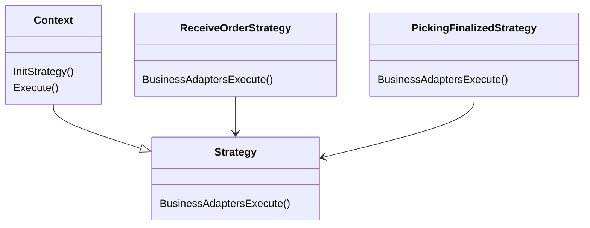

# Strategy design patter

Strategy desging pattern is a behavioral desing patter. This allows you to change the behavior of an object at run time without any 
change in the class of that object.

## When to use 

- When an object needs to support different behavior and you want to change the behavior at run time.
- When you want to avoid a lot of conditionals of choosing the runtime behavior.
- <b>When you have different algorithms that are similir and they only differ in the way they execute some behavior</b>

## Class diagram 

